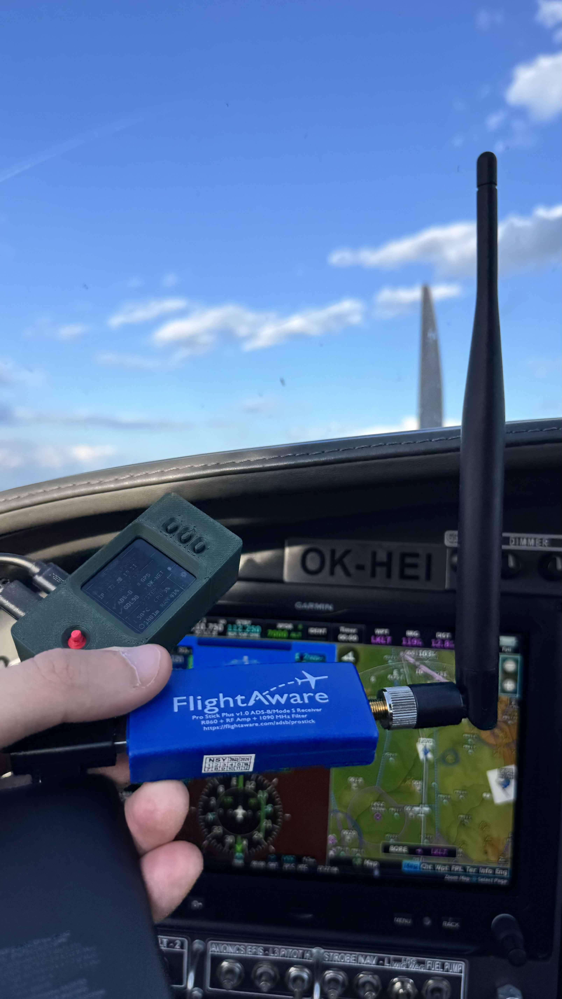
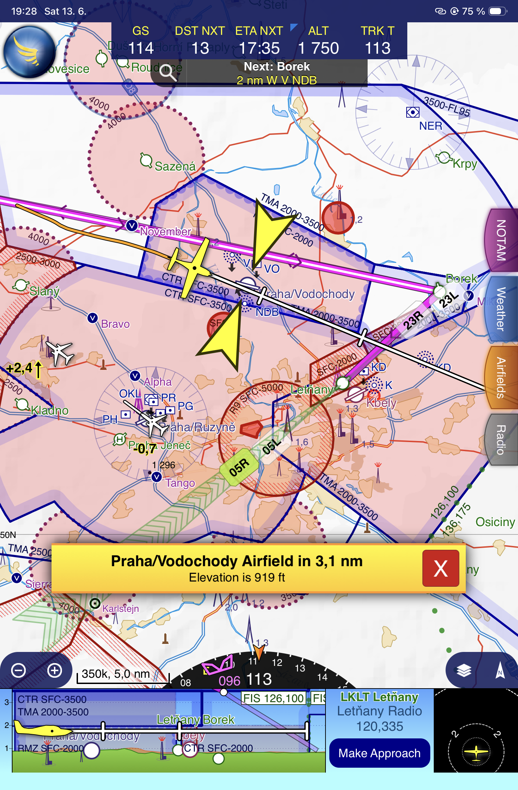
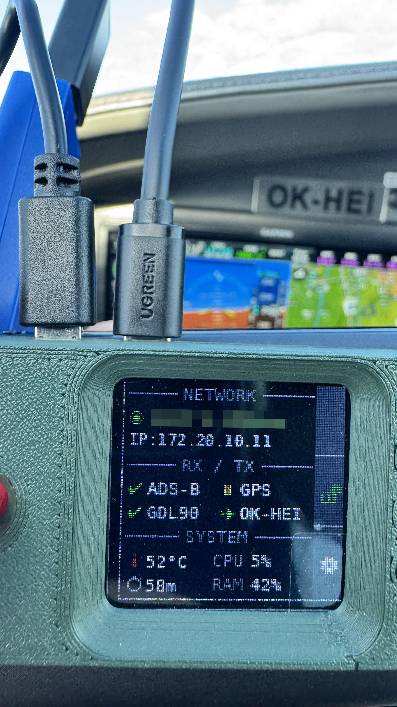
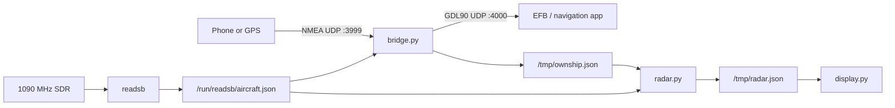

# ads-pi

A lightweight ADS-B traffic receiver, GDL90 broadcaster, and hardware display
for Raspberry Pi.



## Overview

`ads-pi` reads decoded 1090 MHz traffic from
[`readsb`](https://github.com/wiedehopf/readsb), accepts an NMEA GPS feed, and
broadcasts GDL90 traffic and ownship reports to compatible electronic flight
bag (EFB) applications such as SkyDemon.

The project also includes a radar processor and a driver for the Waveshare
1.44-inch LCD HAT.



## Features

- Reads aircraft data from `/run/readsb/aircraft.json`.
- Receives NMEA GPS sentences over UDP port `3999`.
- Broadcasts GDL90 frames over UDP port `4000`.
- Produces filtered radar data for traffic within 10 NM and 5,000 ft.
- Drives a 128x128 ST7735S display with status, radar, network, theme, and
  power screens.
- Supports an optional ownship aircraft override through external
  configuration.
- Uses only the Python standard library for the GDL90 bridge and radar
  processor.



## Data flow



## Hardware

- Raspberry Pi 3B+, 4, or Zero 2 W
- 1090 MHz SDR receiver and antenna
- Phone, tablet, or USB GPS source capable of providing NMEA data
- Optional Waveshare 1.44-inch LCD HAT
- Suitable portable power supply

## Requirements

- Python 3.10 or newer
- `readsb`, configured to write `/run/readsb/aircraft.json`
- SPI enabled on the Raspberry Pi when using the display
- Pillow, `spidev`, and `RPi.GPIO` when using the display

Install the display dependencies from Raspberry Pi OS packages where
available:

```bash
sudo apt update
sudo apt install python3-pil python3-rpi.gpio python3-spidev
```

Install and configure `readsb` for your SDR hardware by following its upstream
documentation. Verify that its JSON output is available before starting the
bridge:

```bash
test -r /run/readsb/aircraft.json && echo "readsb JSON is available"
```

## Installation

Clone the repository:

```bash
git clone https://github.com/yildizan/ads-pi.git
cd ads-pi
```

No system service files are included because users, paths, and deployment
layouts vary. Run the programs manually during setup, then configure your
preferred process manager if required.

## Configuration

Runtime configuration is stored outside the repository in
`/etc/ads-pi.conf`. The file is optional; defaults are used when it does not
exist.

```ini
[display]
theme = dark

[ownship]
icao =
callsign =
```

Set `ownship.icao` and `ownship.callsign` only when you want to identify one
aircraft from the `readsb` feed as ownship. Ownship is normally selected by
the user through the display UI, which saves these values automatically.

The bridge uses a synthetic `0.0, 0.0, 0 ft` position until it receives a
valid NMEA fix.

## Running

Start each component from the repository directory:

```bash
python3 bridge.py
python3 radar.py
python3 display.py
```

`display.py` requires Raspberry Pi GPIO and SPI hardware. The bridge and radar
processor can run without the display.

Configure the GPS source to send NMEA sentences to the Raspberry Pi's IP
address on UDP port `3999`. Connect the EFB device to the same network so it
can receive GDL90 broadcasts on UDP port `4000`.

The application writes transient state to:

- `/tmp/ownship.json`
- `/tmp/radar.json`

An optional `aircraft.db` file beside the Python scripts adds aircraft
registration and emitter-category lookup data. Generated database files are
excluded from Git.

## Project files

- `bridge.py` - readsb/NMEA input and GDL90 output
- `radar.py` - range and altitude filtering for the radar screen
- `display.py` - Waveshare LCD HAT user interface
- `configuration.py` - shared external configuration handling

## Privacy and safety
This is an experimental, do-it-yourself project. Do not use it as the sole
  source of traffic awareness, navigation, or collision avoidance.

## License

This project is available under the [MIT License](LICENSE).
